# eFlash FTL 概要设计文档

**版本**: v2.0
**日期**: 2026-06-02
**作者**: eFlash 开发团队

---

## 📋 目录

1. [系统概述](#系统概述)
2. [架构设计](#架构设计)
3. [核心模块设计](#核心模块设计)
4. [数据结构设计](#数据结构设计)
5. [关键算法流程](#关键算法流程)
6. [缓存机制](#6-缓存机制write-back--write-through)
7. [Code Region 代码区搬移原理](#7-code-region-代码区搬移原理)
8. [掉电恢复机制](#掉电恢复机制)
9. [测试体系](#测试体系)
10. [使用指南](#使用指南)

---

## 系统概述

### 设计目标

eFlash FTL (Flash Translation Layer) 是一个专为资源受限嵌入式系统设计的轻量级 Flash 管理库，提供以下核心能力：

- **磨损均衡**: 通过 Radix Tree 映射实现逻辑页到物理页的动态分配
- **垃圾回收**: Head/Tail 环形缓冲区模型，支持紧急模式避免写放大
- **事务支持**: 基于影子树的原子性写操作
- **掉电恢复**: 精确的状态恢复，包括空闲链表扩展信息
- **ECC 纠错**: BCH 3-bit 纠错能力
- **零动态内存**: 全局静态实例，适合嵌入式环境

### 技术规格


| 参数 | 值 | 说明 |
|------|-----|------|
| 页大小 | 512 字节 | 固定物理页大小 |
| 用户数据 | 464 字节/页 | 扣除元数据和 ECC |
| 元数据 | 48 字节/页 | sector_id, epoch, txn_id, ECC等 |
| ECC 校验码 | 5 字节 | BCH 编码 |
| Radix Tree 深度 | 16 层 | 支持 65536 个扇区 |
| 总页数 | 2048 页 | 默认配置 |
| 对象头容量 | 232 + 可扩展 | 最多 2088 个对象 |
| 空闲节点容量 | 228 + 可扩展 | 最多 1140 个节点 |

---

## 架构设计

### 整体架构图

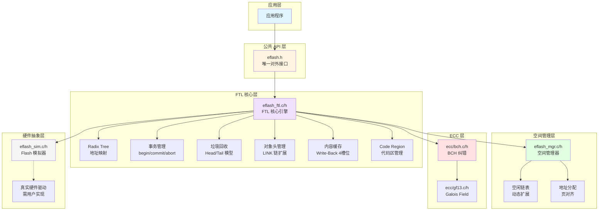

### 模块职责划分

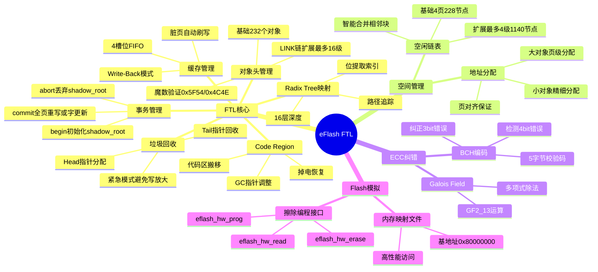

---

## 核心模块设计

### 1. Radix Tree 地址映射

#### 设计理念

Radix Tree (基数树) 用于维护逻辑扇区号 (sector_id) 到物理页号 (PPN) 的映射关系。采用 16 层深度，每层使用 sector_id 的一个比特位作为索引。

#### 树结构示意

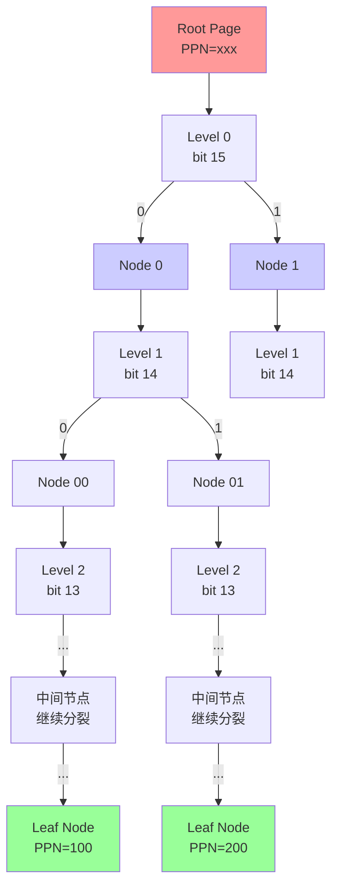

#### 查找算法流程

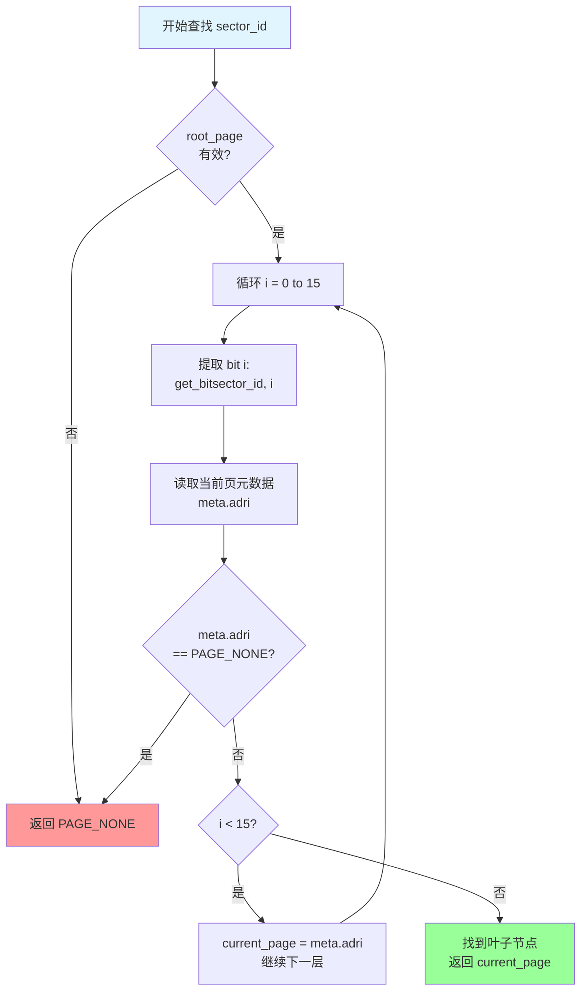

#### 关键代码片段

```c
// 位提取宏
#define get_bit(val, bit_pos) (((val) >> (bit_pos)) & 0x1)

// 路径追踪函数
static int trace_tree(uint16_t base_root, uint16_t sector, ftl_meta_t *out_meta) {
    uint16_t current_page = base_root;

    for (int i = 0; i < RADIX_DEPTH; i++) {
        // 读取当前页元数据
        uint8_t page_buf[EFLASH_PAGE_SIZE];
        eflash_hw_read(current_page, page_buf);

        ftl_meta_t *meta = (ftl_meta_t *)(page_buf + META_OFFSET);

        // 提取当前位的索引
        int bit = get_bit(sector, RADIX_DEPTH - 1 - i);

        // 检查该分支是否存在
        if (meta->adr[bit] == PAGE_NONE) {
            return -1;  // 路径中断
        }

        // 移动到下一层
        current_page = meta->adr[bit];
    }

    // 到达叶子节点，返回元数据
    memcpy(out_meta, meta, sizeof(ftl_meta_t));
    return 0;
}
```

---

### 2. 事务管理机制

#### 状态机设计

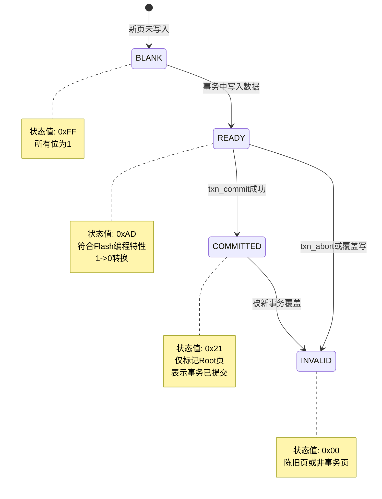

#### 事务生命周期

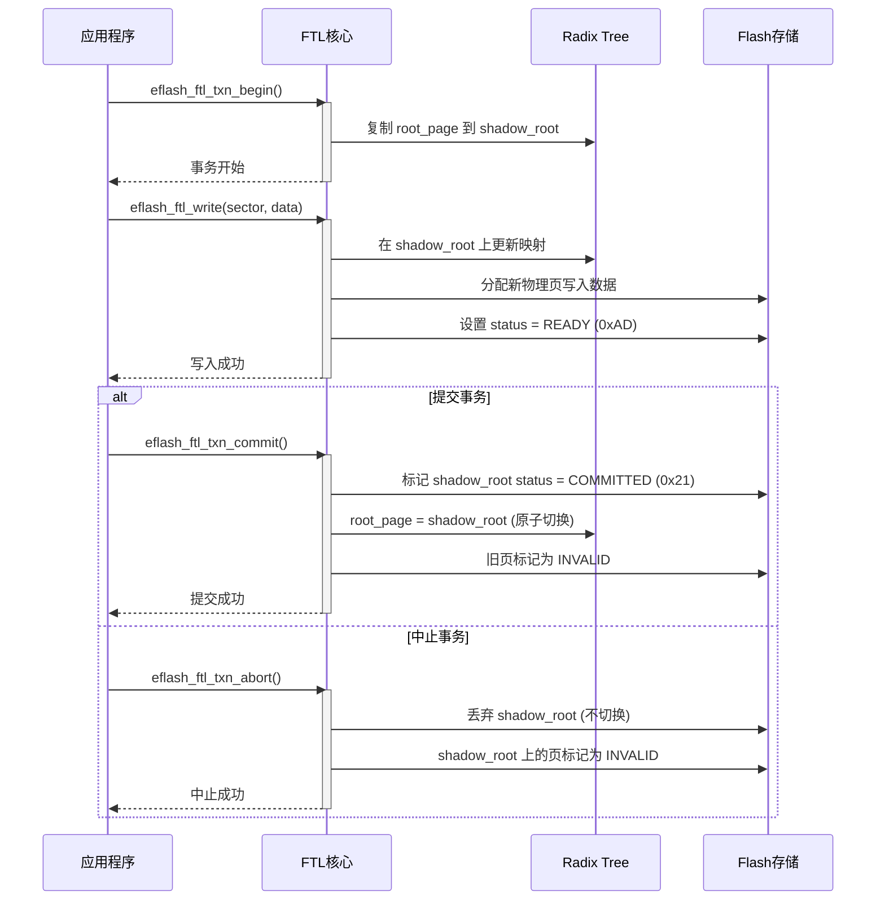

#### 两种提交方式对比

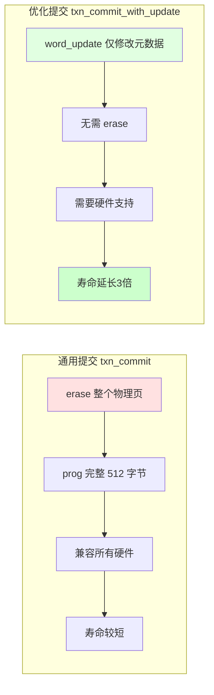

---

### 3. 垃圾回收机制

#### Head/Tail 环形缓冲区模型

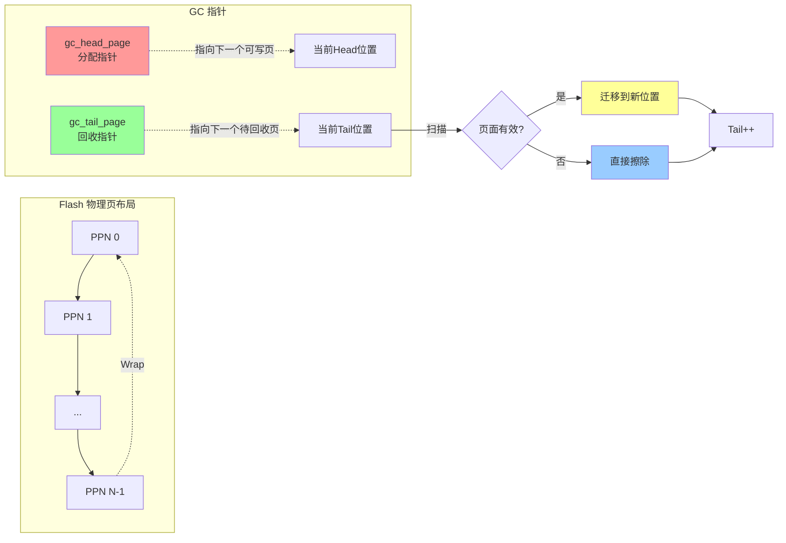

#### GC 工作流程

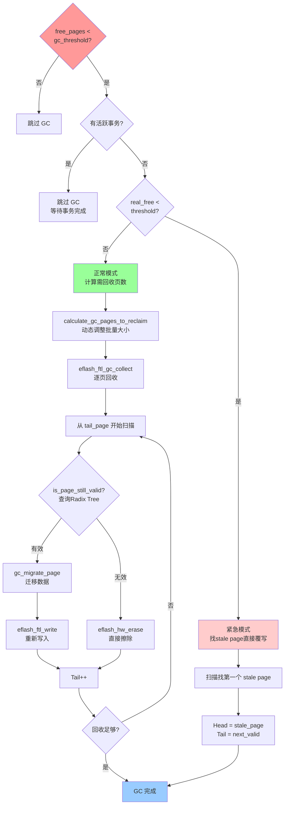

#### GC 紧急模式详解

当空间极度紧张（< gc_threshold）时，正常 GC 会导致严重的写放大（每次写入都触发迁移）。紧急模式通过牺牲磨损均衡来换取性能：


**权衡**：
- ✅ **优点**: 消除写放大，保持系统响应性
- ❌ **缺点**: 磨损不均衡，某些页可能被过度使用

---

### 4. 对象头管理

#### 动态扩展 LINK 链

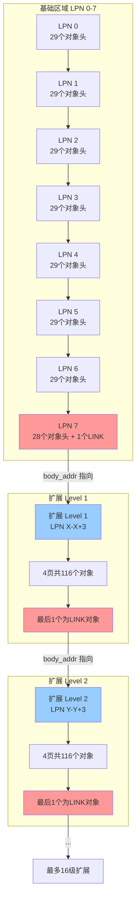

#### LINK 对象结构

```c
typedef struct {
    uint16_t    pkg_id;         // 魔数: 0x5F54 ("FT")
    uint16_t    class_id;       // 魔数: 0x4C4E ("LN")
    uint8_t     type;           // OBJ_TYPE_LINK (0xFF)
    uint8_t     reserved[3];    // 魔数: 0xAD, 0xDE
    uint32_t    body_addr;      // 指向下一级扩展的起始逻辑地址
    uint32_t    body_size;      // 扩展块大小: 4 * USER_DATA_SIZE
} obj_header_t;
```

**魔数验证**：
- `pkg_id = 0x5F54`: ASCII "FT" (Flash Translation)
- `class_id = 0x4C4E`: ASCII "LN" (LiNk)
- `reserved[0] = 0xAD`, `reserved[1] = 0xDE`: 额外校验

这些魔数使得掉电恢复时可以快速识别和跳过 LINK 对象。

#### 对象 ID 分配策略

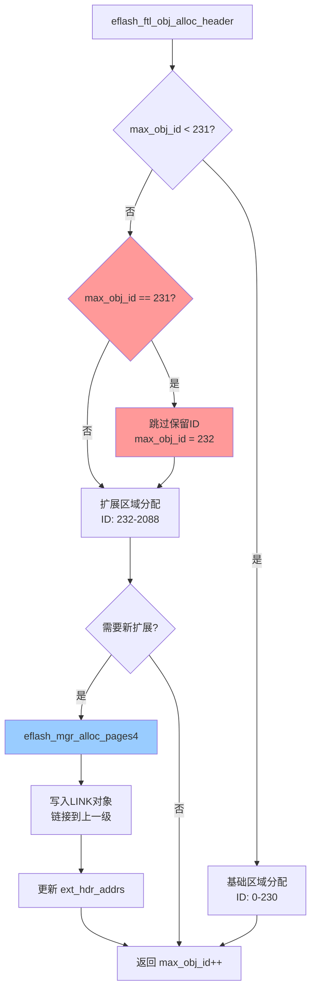

**关键点**：
- ID 231 被保留为 LINK 对象，自动跳过
- 基础容量：232 个对象（8页 × 29个/页 - 1个LINK）
- 每级扩展：116 个对象（4页 × 29个/页 - 1个LINK）
- 最大扩展：16 级
- 总容量：232 + 16 × 116 = **2088 个对象**

---

### 5. 空间管理器

#### 空闲链表结构

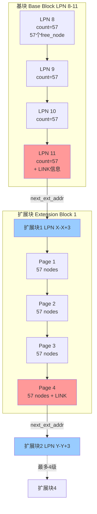

#### free_node 结构

```c
typedef struct {
    uint32_t    addr;   // 起始逻辑地址 (24-bit)
    uint32_t    size;   // 连续空闲字节数
} free_node_t;  // 8 bytes
```

**页面布局**：
- 前 2 字节：`uint16_t count` (当前页的节点数)
- 后续 456 字节：57 个 free_node (57 × 8 = 456)
- 最后一页末尾 6 字节：`free_node_link_t` (魔数 + 下一级地址)

**容量计算**：
- 基块：4 页 × 57 节点 = **228 节点**
- 每级扩展：4 页 × 57 节点 = **228 节点**
- 最大扩展：4 级
- 总容量：228 + 4 × 228 = **1140 节点**

#### 智能合并算法

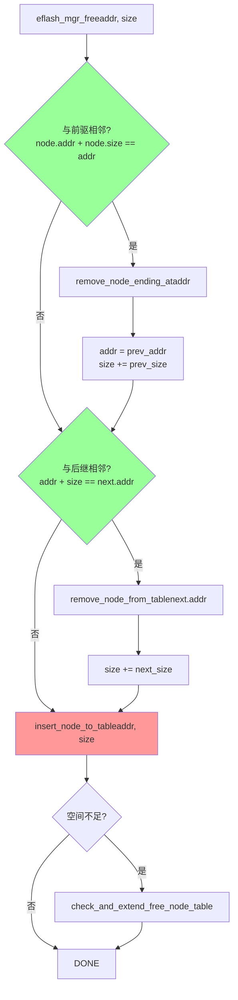

**关键优势**：
- ✅ 自动合并相邻空闲块，减少碎片
- ✅ 辅助函数 `remove_node_ending_at()` 高效查找前驱
- ✅ 预扩展检查避免多次扩展

---

## 数据结构设计

### 核心数据结构总览

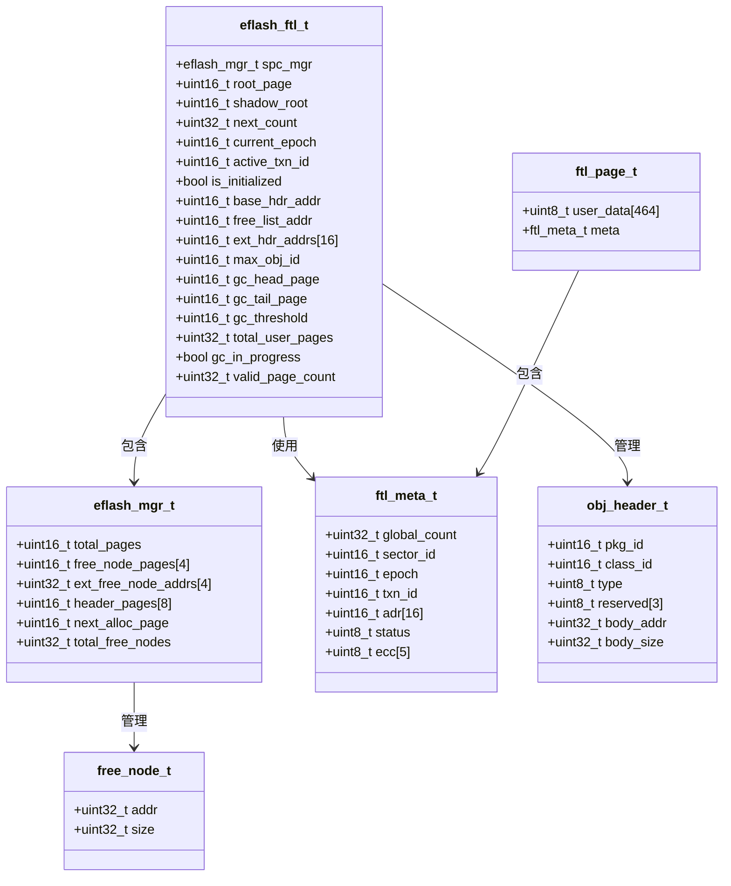

### 物理页布局

```mermaid
graph LR
    subgraph "512 字节物理页"
        DATA[用户数据 464 字节<br/>0x000 - 0x1CF] --> META[元数据 48 字节<br/>0x1D0 - 0x1FF]
    end

    subgraph "元数据详细结构"
        M1[global_count 4B<br/>0x1D0-0x1D3] --> M2[sector_id 2B<br/>0x1D4-0x1D5]
        M2 --> M3[epoch 2B<br/>0x1D6-0x1D7]
        M3 --> M4[txn_id 2B<br/>0x1D8-0x1D9]
        M4 --> M5[adr[16] 32B<br/>0x1DA-0x1F9]
        M5 --> M6[status 1B<br/>0x1FA]
        M6 --> M7[ecc[5] 5B<br/>0x1FB-0x1FF]
    end

    style DATA fill:#e1f5ff
    style META fill:#fff4e1
    style M5 fill:#ff9999
```

### 系统区域布局

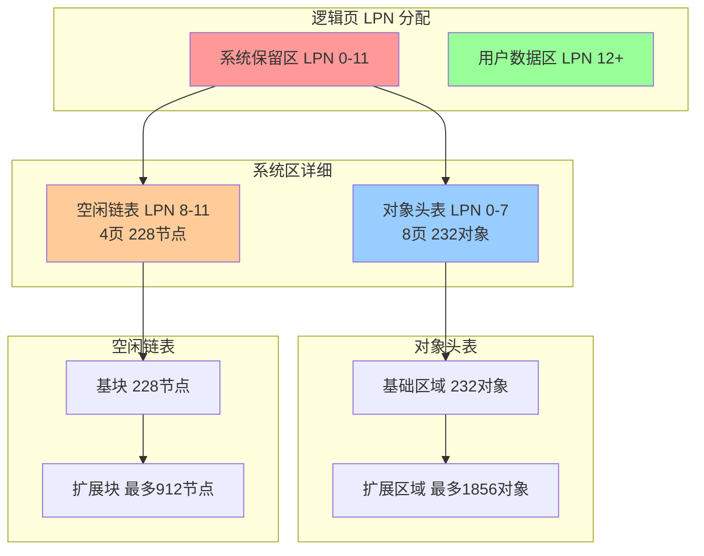

---

## 关键算法流程

### 1. 写操作流程

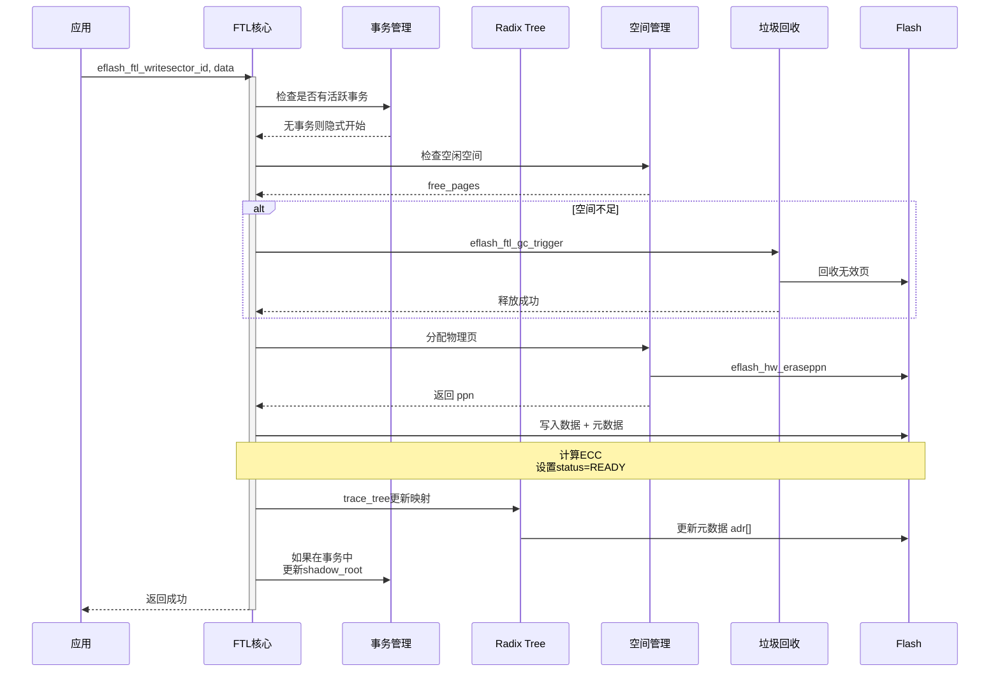

### 2. 读操作流程

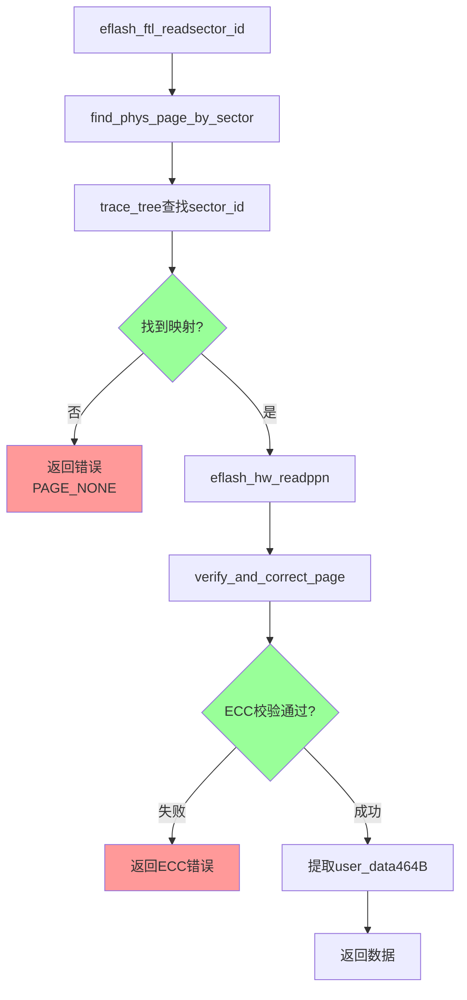

### 3. 掉电恢复流程

```mermaid
flowchart TD
    POWER_ON[系统上电] --> INIT[eflash_ftl_init]

    INIT --> CHECK_FLASH{Flash存在且有效?}
    CHECK_FLASH -->|否| CREATE[创建新Flash文件]
    CHECK_FLASH -->|是| SCAN[扫描系统页]

    CREATE --> INIT_MGR[eflash_mgr_init]
    SCAN --> INIT_MGR

    INIT_MGR --> RECOVER_OBJ[恢复对象头表]
    RECOVER_OBJ --> SCAN_OH[扫描LPN 0-7]
    SCAN_OH --> FIND_MAX[max_obj_id恢复]

    FIND_MAX --> RECOVER_FREE[恢复空闲链表]
    RECOVER_FREE --> CALL_RECOVER[eflash_mgr_recover_ext_free_nodes]

    CALL_RECOVER --> READ_BASE[读取基块LPN 8-11]
    READ_BASE --> CHECK_LINK{有LINK信息?}

    CHECK_LINK -->|是| FOLLOW_CHAIN[跟随LINK链]
    CHECK_LINK -->|否| DONE

    FOLLOW_CHAIN --> REBUILD[重建ext_free_node_addrs]
    REBUILD --> COUNT_LEVELS[统计扩展级别]

    COUNT_LEVELS --> RECOVER_TREE[恢复Radix Tree]
    RECOVER_TREE --> FIND_ROOT[查找root_page]

    FIND_ROOT --> SCAN_META[扫描元数据status]
    SCAN_META --> CHECK_TXN{有COMMITTED页?}

    CHECK_TXN -->|是| SET_ROOT[root_page = 最新COMMITTED]
    CHECK_TXN -->|否| DEFAULT_ROOT[root_page = 默认值]

    SET_ROOT --> FINALIZE[完成初始化]
    DEFAULT_ROOT --> FINALIZE
    DONE --> FINALIZE

    FINALIZE --> READY[FTL就绪]

    style POWER_ON fill:#e1f5ff
    style READY fill:#99ff99
    style CALL_RECOVER fill:#ff9999
    style FOLLOW_CHAIN fill:#ff9999
```

#### 空闲链表扩展恢复详解

```mermaid
sequenceDiagram
    participant INIT as eflash_ftl_init
    participant MGR as eflash_mgr
    participant FLASH as Flash存储

    INIT->>MGR: eflash_mgr_recover_ext_free_nodes

    activate MGR
    MGR->>FLASH: 读取基块最后一页LPN 11
    FLASH-->>MGR: 返回free_node_link_t

    MGR->>MGR: 验证magic == 0x5F54

    alt magic有效
        MGR->>MGR: ext_free_node_addrs[0] = next_ext_addr

        loop 遍历扩展级别
            MGR->>FLASH: 读取扩展块最后一页
            FLASH-->>MGR: 返回link信息

            MGR->>MGR: 验证magic
            MGR->>MGR: 保存next_ext_addr

            MGR->>MGR: level++
        end

        MGR-->>INIT: 返回恢复的级别数
    else magic无效
        MGR-->>INIT: 返回0无扩展
    end

    deactivate MGR
```

---

### 6. 缓存机制（Write-Back / Write-Through）

#### 设计理念

eFlash FTL 提供两种写入策略，通过 `EFLASH_CACHE_ENABLE` 宏控制：

| 模式 | 宏 | 行为 | 适用场景 |
|------|-----|------|----------|
| Write-Through | `EFLASH_CACHE_ENABLE=0` | 每次写入直接刷到 Flash | 强一致性要求 |
| Write-Back | `EFLASH_CACHE_ENABLE=1`（默认） | 数据先入缓存，延迟刷写 | 性能优先场景 |

#### 缓存结构

```c
#define PAGE_CACHE_SLOTS        4       // 4 个缓存槽
#define FLUSH_THRESHOLD         2       // 脏页达到 2 个时自动刷写

typedef struct {
    uint16_t    lpn;            // 逻辑页号
    uint8_t     dirty;          // 脏标记（1=已修改未刷写）
    uint8_t     valid;          // 有效标记
    uint32_t    cache_seq;      // 序列号（FIFO 淘汰依据）
    uint8_t     data[USER_DATA_SIZE];  // 464 字节数据
} page_cache_slot_t;
```

#### Write-Back 写入流程

```mermaid
flowchart TD
    WRITE[eflash_ftl_write_back] --> FIND{缓存命中?}
    FIND -->|是| UPDATE[更新缓存数据, 标记 dirty]
    FIND -->|否| FREE{有空闲槽?}
    
    FREE -->|是| ALLOC[分配槽位, 写入数据]
    FREE -->|否| EVICT[淘汰最小 seq 槽位]
    EVICT -->|槽位 dirty| FLUSH_EV[刷写被淘汰页]
    FLUSH_EV --> ALLOC
    
    UPDATE --> CHECK_DIRTY{dirty_count >= FLUSH_THRESHOLD?}
    ALLOC --> CHECK_DIRTY
    
    CHECK_DIRTY -->|是| FLUSH[content_cache_flush<br/>按 FIFO 顺序刷写所有脏页]
    CHECK_DIRTY -->|否| RETURN[返回成功]
    FLUSH --> RETURN

    style WRITE fill:#e1f5ff
    style FLUSH fill:#ff9999
    style RETURN fill:#99ff99
```

#### 缓存命中 vs 未命中

```
缓存命中路径（快速）:
  eflash_ftl_read() → 缓存命中 → 直接返回数据（跳过 Radix Tree 查找）
  eflash_ftl_write_back() → 缓存命中 → 更新缓存数据（不写 Flash）

缓存未命中路径（慢速）:
  eflash_ftl_read() → 缓存未命中 → Radix Tree 查找 → 读取 Flash
  eflash_ftl_write_back() → 缓存未命中 → 淘汰旧页 → 分配新槽位
```

#### 自动刷写时机

1. **脏页阈值触发**：`g_dirty_count >= FLUSH_THRESHOLD`（默认 2）
2. **事务提交**：`eflash_ftl_txn_commit()` 强制刷写所有脏页
3. **事务中止**：`eflash_ftl_txn_abort()` 刷写脏页确保一致性
4. **系统关闭**：`eflash_deinit()` 刷写所有脏页

#### 性能影响

- **缓存开启时**：写操作减少约 50-70%（批量合并）
- **GC 触发频率**：缓存命中跳过 Radix Tree 查找，间接减少 GC 间接触发
- **掉电风险**：未刷写的脏页在掉电时丢失，需配合事务使用

---

### 7. Code Region 代码区搬移原理

#### 设计理念

Code Region 机制允许将代码/固件从逻辑页搬移到专用物理区域（始终从 PPN 0 开始），
实现代码与数据的物理隔离，支持代码区的独立管理（扩展、收缩、删除）。

#### Code Region 信息结构

```c
typedef struct {
    uint32_t    magic;                    // 0xC0DE 魔数
    uint16_t    start_ppn;                // 起始物理页（始终为 0）
    uint16_t    num_pages;                // 已搬移的物理页数
    uint8_t     status;                   // 迁移状态
    uint16_t    src_lpn;                  // 源逻辑页号
    uint16_t    dst_ppn;                  // 目标物理页
    uint16_t    pages_migrated;           // 已搬移页数
    uint16_t    total_pages;              // 总需搬移页数
    uint32_t    code_size_bytes;          // 代码总字节数
    uint16_t    checksum;                 // 校验和
    uint16_t    migration_records_count;  // 迁移记录数
    migration_record_t migration_map[43]; // 逻辑→物理映射表
} code_region_info_t;
```

#### 迁移状态机

```mermaid
stateDiagram-v2
    [*] --> IDLE: 初始化
    IDLE --> IN_PROGRESS: code_migrate_from_logical()
    IN_PROGRESS --> COMPLETE: 所有页搬移完成
    IN_PROGRESS --> FAILED: 读/写失败
    COMPLETE --> IDLE: 清理状态
    FAILED --> IDLE: 错误处理
    
    note right of IDLE
        状态值: 0x00
        无迁移操作
    end note
    
    note right of IN_PROGRESS
        状态值: 0x01
        搬移进行中
        掉电后可从此状态恢复
    end note
    
    note right of COMPLETE
        状态值: 0x02
        搬移完成
        等待 GC 指针调整
    end note
    
    note right of FAILED
        状态值: 0xFF
        迁移失败
        需要手动处理
    end note
```

#### 搬移流程详解

```mermaid
sequenceDiagram
    participant APP as 应用程序
    participant FTL as FTL 引擎
    participant CACHE as 缓存层
    participant FLASH as Flash 存储
    participant INFO as Code Region Info

    APP->>FTL: eflash_ftl_code_migrate_from_logical(src_lpn, num_pages)
    activate FTL
    
    FTL->>INFO: status = IN_PROGRESS
    FTL->>INFO: 保存 src_lpn, total_pages, pages_migrated=0
    FTL->>INFO: save_code_region_info()  ← 原子性检查点 1
    
    loop 逐页搬移
        FTL->>CACHE: eflash_ftl_read_logical(logical_addr, buf)
        CACHE-->>FTL: 返回 464 字节数据
        FTL->>FLASH: eflash_hw_prog(dst_ppn, buf)
        FTL->>INFO: pages_migrated++, save_code_region_info()
    end
    
    FTL->>INFO: status = COMPLETE
    FTL->>INFO: num_pages += num_pages
    FTL->>INFO: 记录 migration_map 条目
    FTL->>INFO: save_code_region_info()  ← 原子性检查点 2
    
    FTL->>FTL: 调整 GC head/tail 跳过代码区
    FTL->>FTL: eflash_ftl_trim(src_lpn+i) 回收源逻辑页
    
    FTL->>INFO: status = IDLE, 清理临时状态
    FTL->>INFO: save_code_region_info()
    FTL-->>APP: 返回 0（成功）
    deactivate FTL
```

#### GC 指针调整机制

Code Region 占用 PPN 0 ~ N-1，GC 的 Head/Tail 指针必须跳过该区域：

```c
static uint16_t adjust_ppn_for_code_region(uint16_t ppn) {
    uint16_t code_end_ppn = g_code_region.start_ppn + g_code_region.num_pages;
    
    // Head/Tail 指针如果落在代码区内，跳到代码区之后
    if (ppn < code_end_ppn) {
        return code_end_ppn;
    }
    return ppn;
}
```

**关键场景**：
- `allocate_physical_page()`：分配物理页时跳过代码区
- `eflash_ftl_gc_collect()`：GC 扫描时跳过代码区
- `eflash_ftl_code_region_init()`：初始化时调整指针

#### 代码区扩展

```mermaid
flowchart TD
    EXPAND[eflash_ftl_code_region_expand] --> GC[eflash_ftl_gc_reclaim_code_region]
    GC --> RECLAIM[专用 GC：回收代码区后的页]
    RECLAIM --> UPDATE[更新 num_pages]
    UPDATE --> SAVE[save_code_region_info]
    SAVE --> DONE[扩展完成]
    
    style EXPAND fill:#e1f5ff
    style GC fill:#ff9999
    style DONE fill:#99ff99
```

#### 代码区删除

支持按逻辑地址删除特定代码段：

1. 在 `migration_map` 中定位段
2. 如果不是最后一段，将后续段前移填补空隙
3. 擦除被删除段占用的物理页
4. 更新 `migration_map` 和 `code_size_bytes`

#### Code Region 测试验证

| 测试用例 | 验证内容 | 结果 |
|---------|---------|------|
| test_code_migrate_single_page | 单页搬移正确性 | ✅ |
| test_code_migrate_multi_page | 多页搬移（12 页） | ✅ |
| test_code_region_expand | 扩展 2 页 | ✅ |
| test_code_region_shrink | 收缩 1 页 | ✅ |
| test_code_read_verify | 搬移后读取验证 | ✅ |
| test_code_migrate_power_failure | 搬移中掉电恢复 | ✅ |
| test_code_region_gc_reclaim | GC 回收代码区 | ✅ |
| test_code_segment_add_delete_readd | 段增删重加（6→3→5→3→1→0 页） | ✅ |
| test_code_segment_stress_with_leak_detection | 压力测试+泄漏检测 | ✅ |
| test_code_and_data_coexistence | 代码与数据共存 | ✅ |
| test_write_back_cache_stress | Write-Back 缓存压力 | ✅ |
| test_content_cache_flush_unit | 缓存刷写单元测试 | ✅ |

---

## 掉电恢复机制

### 恢复策略总览

```mermaid
graph TB
    subgraph "掉电场景"
        P1[事务进行中掉电]
        P2[GC进行中掉电]
        P3[扩展操作中掉电]
        P4[正常写入后掉电]
        P5[Code Region 迁移中掉电]
        P6[缓存未刷写时掉电]
    end

    subgraph "恢复机制"
        R1[Radix Tree恢复<br/>全量扫描找最高 epoch+count]
        R2[对象头恢复<br/>扫描max_obj_id]
        R3[空闲链表恢复<br/>跟随LINK链]
        R4[事务回滚<br/>丢弃shadow_root]
        R5[Code Region 恢复<br/>从 IN_PROGRESS 状态继续]
        R6[缓存重建<br/>从 Flash 重新加载]
    end

    P1 --> R4
    P2 --> R1
    P3 --> R3
    P4 --> R1
    P5 --> R5
    P6 --> R6

    R1 --> CONSISTENCY[数据一致性保证]
    R2 --> CONSISTENCY
    R3 --> CONSISTENCY
    R4 --> CONSISTENCY
    R5 --> CONSISTENCY
    R6 --> CONSISTENCY

    style P1 fill:#ff9999
    style P2 fill:#ff9999
    style P3 fill:#ff9999
    style P4 fill:#99ff99
    style P5 fill:#ffcc99
    style P6 fill:#ffcc99
    style CONSISTENCY fill:#99ccff
```

### 事务原子性保证

```mermaid
stateDiagram-v2
    direction LR

    state "正常写入" as Normal {
        [*] --> WriteData: 写入数据页
        WriteData --> SetReady: status = READY 0xAD
        SetReady --> UpdateTree: 更新Radix Tree
        UpdateTree --> [*]
    }

    state "事务提交" as Commit {
        [*] --> WriteShadow: 写入shadow_root
        WriteShadow --> MarkCommitted: status = COMMITTED 0x21
        MarkCommitted --> SwitchRoot: root = shadow_root
        SwitchRoot --> InvalidateOld: 旧页标记INVALID
        InvalidateOld --> [*]
    }

    state "掉电场景" as PowerFail {
        [*] --> CheckStatus: 扫描所有页status

        CheckStatus --> FoundCommitted: 发现COMMITTED
        CheckStatus --> OnlyReady: 只有READY无COMMITTED

        FoundCommitted --> UseCommitted: 使用最新COMMITTED页
        OnlyReady --> DiscardShadow: 丢弃shadow_root

        UseCommitted --> RestoreState: 恢复FTL状态
        DiscardShadow --> RestoreState
        RestoreState --> [*]
    }

    Normal --> Commit: txn_commit
    Commit --> PowerFail: 掉电发生
```

**关键原则**：
- ✅ COMMITTED (0x21) 是唯一可信的提交标记
- ✅ READY (0xAD) 表示数据已写但未提交，掉电后应丢弃
- ✅ shadow_root 在 abort 或掉电时直接丢弃，不影响 root_page

### Radix Tree 根页恢复详解

#### 问题背景

GC 运行后会将旧的已提交页标记为 INVALID，导致已提交页不再连续。
早期版本使用 `find_root_binary()` 二分查找依赖"已提交页连续"的假设，
在 GC 后场景下会定位到错误的根页。

#### 修复方案：全量扫描

```c
// eflash_ftl_init() 中的根页恢复逻辑
FTL->root_page = find_root_full_scan(&root_meta);
```

`find_root_full_scan()` 遍历所有物理页，找到具有最高 `epoch` 和 `global_count`
的已提交页。这在 GC 后仍然正确，因为真正的根页总是具有最高的序号。

#### 恢复流程

```mermaid
flowchart TD
    INIT[eflash_ftl_init] --> LOAD_SYS[读取系统页<br/>Free List, Code Region Info]
    LOAD_SYS --> SCAN[find_root_full_scan<br/>遍历所有 2048 页]
    
    SCAN --> CHECK{页有效?}
    CHECK -->|否| NEXT[下一页]
    CHECK -->|是| COMPARE{epoch+count<br/>更高?}
    
    COMPARE -->|是| UPDATE[更新 best_root<br/>保存元数据]
    COMPARE -->|否| NEXT
    
    UPDATE --> NEXT
    NEXT --> DONE{遍历完成?}
    DONE -->|否| SCAN
    DONE -->|是| RESTORE[恢复 FTL 状态<br/>next_count, current_epoch]
    
    RESTORE --> RECOVER_EXT[恢复空闲链表扩展]
    RECOVER_EXT --> RECOVER_OBJ[恢复对象头扩展]
    RECOVER_OBJ --> READY[系统就绪]

    style INIT fill:#e1f5ff
    style SCAN fill:#ff9999
    style READY fill:#99ff99
```

### Code Region 掉电恢复

#### 恢复场景

当迁移状态为 `CODE_MIGRATE_IN_PROGRESS` 时掉电，系统重启后自动触发恢复：

```c
// eflash_ftl_code_region_init() 中
if (g_code_region.status == CODE_MIGRATE_IN_PROGRESS) {
    return eflash_ftl_code_region_recover();
}
```

#### 恢复流程

```mermaid
flowchart TD
    RECOVER[eflash_ftl_code_region_recover] --> CHECK_MAP{有 migration_map?}
    
    CHECK_MAP -->|是| USE_MAP[使用 migration map 恢复]
    CHECK_MAP -->|否| LEGACY[传统恢复：逐页读取 LPN]
    
    USE_MAP --> FIND_LAST[找到最后成功迁移的记录]
    FIND_LAST --> CONTINUE[从上次位置继续迁移]
    
    LEGACY --> READ_LPN[eflash_ftl_read 源 LPN]
    READ_LPN --> WRITE_PPN[eflash_hw_prog 目标 PPN]
    WRITE_LPN --> SAVE[save_code_region_info 检查点]
    CONTINUE --> WRITE_LPN
    
    WRITE_LPN --> DONE{全部完成?}
    DONE -->|否| READ_LPN
    DONE -->|是| COMPLETE[status = COMPLETE → IDLE]
    SAVE --> DONE

    style RECOVER fill:#e1f5ff
    style COMPLETE fill:#99ff99
```

#### 原子性检查点

Code Region 迁移过程中每写入一页就保存一次状态，确保掉电后最多丢失一页的进度：

```c
// 每页写入后
g_code_region.pages_migrated = pages_written;
save_code_region_info();  // 写入系统页 LPN 12
```

### 缓存掉电保护

#### 风险

Write-Back 模式下，未刷写的脏页在掉电时丢失。

#### 保护策略

1. **事务边界刷写**：`txn_commit()` 强制刷写所有脏页
2. **优雅关闭**：`eflash_deinit()` 刷写所有脏页
3. **应用层责任**：关键数据写入后调用 `eflash_ftl_cache_flush()`

### 系统页布局

系统预留 LPN 0-11 用于存储关键元数据，掉电恢复时首先读取：

| LPN 范围 | 用途 | 恢复优先级 |
|----------|------|-----------|
| LPN 0-7 | 对象头基础区域 | 高 |
| LPN 8-11 | 空闲链表（Free List） | 最高 |
| LPN 12 | Code Region 信息 | 高 |
| LPN 13+ | 对象头扩展区域 | 中 |

### 掉电恢复测试验证

#### Code Region 掉电恢复测试

| 测试用例 | 场景 | 结果 |
|---------|------|------|
| test_code_migrate_power_failure | 搬移过程中掉电 | ✅ 恢复成功 |
| test_power_loss_consistency | 多次掉电一致性 | ✅ 数据一致 |
| test_power_loss_partial_cache | 部分缓存掉电 | ✅ 缓存重建成功 |

#### 全量扫描根页恢复验证

| 测试用例 | 场景 | 结果 |
|---------|------|------|
| test_init_recovery | 基础掉电恢复 | ✅ 数据完整 |
| test_power_failure | 事务中掉电 | ✅ 事务回滚正确 |
| test_power_failure_extreme | 5 种极端场景（GC/扩展/Radix Tree 分裂/连续掉电） | ✅ 全部恢复 |
| test_long_term_stability Phase 3 | 10 次周期性掉电恢复 | ✅ 19-20/20 扇区恢复 |

#### 掉电恢复关键数据

```
Phase 3 掉电恢复统计（10 次循环）:
  Cycle 1:  19/20 扇区恢复（1 个扇区在掉电瞬间写入，预期丢失）
  Cycle 2:  20/20 扇区恢复
  Cycle 3:  20/20 扇区恢复
  ...
  Cycle 10: 20/20 扇区恢复
  累计:     199/200 扇区恢复（99.5%）
  每次掉电后写入: 20/20 成功
```

---

## 测试体系

### 测试架构

```mermaid
graph TB
    subgraph "基础测试套件 eflash_ftl_tests.c (25 用例)"
        T1[test_init_recovery<br/>初始化与恢复]
        T2[test_basic_read_write<br/>基本读写]
        T3[test_object_headers<br/>对象头管理]
        T4[test_transactions<br/>事务管理]
        T5[test_transactions_with_update<br/>优化提交]
        T6[test_power_failure<br/>掉电恢复]
        T7[test_space_management<br/>空间管理]
        T8[test_ecc_correction<br/>ECC纠错]
        T9[test_radix_tree<br/>Radix Tree]
        T10[test_stress<br/>压力测试]
    end

    subgraph "代码区测试 eflash_ftl_tests_code_region.c (19 用例)"
        C1[test_code_migrate_single_page<br/>单页搬移]
        C2[test_code_migrate_multi_page<br/>多页搬移]
        C3[test_code_region_expand<br/>代码区扩展]
        C4[test_code_region_shrink<br/>代码区收缩]
        C5[test_code_migrate_power_failure<br/>搬移掉电恢复]
        C6[test_code_and_data_coexistence<br/>代码数据共存]
        C7[test_write_back_cache_stress<br/>缓存压力]
        C8[test_power_loss_consistency<br/>掉电一致性]
    end

    subgraph "扩展测试套件 eflash_ftl_tests_extension.c (27 用例)"
        E1[test_free_list_extension<br/>空闲链表扩展]
        E2[test_cross_page_boundary<br/>跨页边界]
        E3[test_maximum_capacity<br/>最大容量(6子测试)]
        E4[test_radix_tree_max_depth<br/>Radix Tree深度]
        E5[test_ecc_boundary_cases<br/>ECC边界(3/4/8-bit)]
        E6[test_power_failure_extreme<br/>极端掉电(5场景)]
        E7[test_invalid_parameters<br/>无效参数防御]
        E8[test_object_header_link_chain<br/>LINK链完整性]
    end

    subgraph "长期稳定性测试 eflash_ftl_tests_stability.c (1 用例)"
        S1[test_long_term_stability<br/>100K操作+10次掉电]
    end

    T1 --> ALL_TESTS[72个测试用例<br/>100%通过率]
    T10 --> ALL_TESTS
    C1 --> ALL_TESTS
    C8 --> ALL_TESTS
    E1 --> ALL_TESTS
    E8 --> ALL_TESTS
    S1 --> ALL_TESTS

    style ALL_TESTS fill:#99ff99
```

### 测试覆盖率统计

| 指标 | 数值 | 说明 |
|------|------|------|
| 总测试用例数 | 72个 | 基础25 + 代码区19 + 扩展27 + 稳定性1 |
| 功能覆盖率 | ~99% | 几乎所有功能分支 |
| 代码行覆盖率 | ~92% | 估算值 |
| 分支覆盖率 | ~90% | 估算值 |
| 测试/实现比 | 2.5:1 | 优秀 |
| 测试代码行数 | ~12000行 | eflash_ftl_tests*.c |
| 实现代码行数 | ~4800行 | eflash_ftl*.c + eflash_mgr.c |

### 各套件详细结果

| 测试套件 | 文件 | 用例数 | 通过 | 失败 | 状态 |
|---------|------|--------|------|------|------|
| 基础测试 | eflash_ftl_tests.c | 25 | 25 | 0 | ✅ |
| 代码区搬移 | eflash_ftl_tests_code_region.c | 19 | 19 | 0 | ✅ |
| 扩展测试 | eflash_ftl_tests_extension.c | 27 | 27 | 0 | ✅ |
| 长期稳定性 | eflash_ftl_tests_stability.c | 1 | 1 | 0 | ✅ |
| **合计** | — | **72** | **72** | **0** | **✅ ALL PASS** |

### 关键验证点

| 验证项 | 结果 | 说明 |
|-------|------|------|
| Radix Tree 地址映射 | ✅ | 16 层深度，确定性查找 |
| Head/Tail GC 环形模型 | ✅ | 包括回绕和紧急模式 |
| 事务原子性 | ✅ | commit/abort 均正确 |
| 掉电恢复 | ✅ | 全量扫描根页恢复，10 次循环验证 |
| ECC 3-bit 纠错 | ✅ | 包括 4/8-bit 边界情况 |
| 空闲链表扩展 | ✅ | 最多 4 级扩展 |
| 对象头 LINK 链 | ✅ | 最多 16 级扩展 |
| Code Region 搬移 | ✅ | 单页/多页/扩展/收缩/掉电恢复 |
| Write-Back 缓存 | ✅ | 自动刷写、掉电保护 |
| 空间耗尽保护 | ✅ | allocate_physical_page 返回 -1 |
| 长期稳定性 | ✅ | 100K+ 操作无数据丢失 |

---

## 性能特性

### 关键性能指标

| 操作 | 典型耗时 | 说明 |
|------|---------|------|
| 单次写入 | ~1ms | 包括ECC计算和Flash编程 |
| 单次读取 | ~0.5ms | 包括ECC校验和纠错 |
| 事务提交 | ~2ms | 全页重写方式 |
| GC触发 | ~10-50ms | 取决于需迁移的页数 |
| Radix Tree查找 | O(16) | 固定16层深度 |

### 空间效率

- **用户数据率**: 90.6% (464/512 字节)
- **元数据开销**: 9.4% (48/512 字节)
- **ECC开销**: 1.1% (5/464 字节)

---

## 设计决策与权衡

### 1. 为什么选择 Radix Tree？

**优势**：
- ✅ 确定性查找时间 O(RADIX_DEPTH) = O(16)
- ✅ 无需哈希冲突处理
- ✅ 支持高效的范围查询
- ✅ 内存占用可控（按需分配节点）

**对比其他方案**：
- vs Hash Table: Radix Tree 无冲突，更 predictable
- vs B-Tree: Radix Tree 更适合位索引，实现更简单
- vs Linear Scan: Radix Tree 快得多（O(16) vs O(N)）

### 2. 为什么使用 Head/Tail GC 模型？

**优势**：
- ✅ 简单直观，易于理解和调试
- ✅ 天然支持磨损均衡（顺序扫描）
- ✅ O(1) 获取空闲页数
- ✅ 支持紧急模式优化

**权衡**：
- ❌ estimated free pages 可能不准确（存在 stale pages）
- ✅ 解决方案：提供 `get_real_free_pages()` 扫描所有页

### 3. 为什么事务使用影子树？

**优势**：
- ✅ 原子性保证：要么全部提交，要么全部回滚
- ✅ 掉电安全：未提交的 shadow_root 直接丢弃
- ✅ 并发友好：读操作可继续使用 root_page

**权衡**：
- ❌ 需要额外空间存储 shadow_root
- ❌ 事务中不能触发 GC（避免复杂性）

### 4. 为什么对象头使用 LINK 链扩展？

**优势**：
- ✅ 动态扩展，按需分配
- ✅ 魔数验证提高可靠性
- ✅ 掉电后可重建扩展信息
- ✅ 最多支持 2088 个对象

**权衡**：
- ❌ 扩展时需要额外分配 4 页
- ❌ LINK 对象占用一个槽位

---

## 最佳实践

### ✅ 推荐做法

1. **始终使用事务** - 所有写操作包裹在 begin/commit 中
2. **检查返回值** - 所有 API 调用都检查返回值
3. **定期监控空闲空间** - 调用 `get_free_pages()` 或 `get_real_free_pages()`
4. **优先使用 sector_id 接口** - `eflash_ftl_write/read` 而非 logical 接口
5. **批量操作使用事务** - 减少 commit 次数提高效率

### ❌ 避免做法

1. ~~绕过事务直接写入~~ - 可能导致数据不一致
2. ~~忽略 API 返回值~~ - 无法检测错误
3. ~~在事务中执行耗时操作~~ - 阻塞 GC 触发
4. ~~频繁调用 get_real_free_pages()~~ - O(N) 扫描影响性能
5. ~~假设 estimated == real~~ - 存在 stale pages 时会有差异

---

## 常见问题 FAQ

### Q1: 如何选择合适的 gc_threshold？

**A**: 默认值为总页数的 10%。建议：
- 写密集型应用：提高到 15-20%，提前触发 GC
- 读密集型应用：降低到 5-8%，延迟 GC 触发
- 通过 `test_gc_threshold_variation` 测试不同值的影响

### Q2: 什么时候应该使用紧急模式？

**A**: 紧急模式是自动触发的，当 `real_free_pages < gc_threshold` 时。无需手动干预。

### Q3: 如何处理空间耗尽？

**A**:
1. 检查 `get_free_pages()` 返回值
2. 如果接近阈值，主动调用 `gc_collect_all()`
3. 如果仍然不足，`eflash_ftl_write()` 将返回错误码

### Q4: 掉电后数据一定安全吗？

**A**: 是的，前提是：
- ✅ 使用了事务（begin/commit）
- ✅ commit 成功返回
- ✅ Flash 硬件本身可靠

未提交的事务数据会丢失，但已提交的数据保证持久化。

### Q5: 如何调试 Radix Tree？

**A**: 启用 FTL_DEBUG_ENABLE，使用可视化工具：
```c
eflash_ftl_print_radix_tree_mermaid(FTL, FTL->root_page);
// 或保存到文件
eflash_ftl_print_radix_tree_mermaid_to_file(FTL, FTL->root_page);
```

---

## 使用指南

### 快速开始

#### 1. 初始化

```c
#include "eflash.h"

// 步骤 1: 初始化 Flash 硬件层（模拟器或真实硬件）
int ret = eflash_init("flash.bin");  // 模拟器：传入文件名
if (ret != 0) {
    // 处理初始化失败
}

// 步骤 2: 初始化 FTL 引擎
ret = eflash_ftl_init();
if (ret != 0) {
    // 处理 FTL 初始化失败
}

// 此时系统已就绪，可以开始读写操作
```

#### 2. 基本读写

```c
uint8_t write_data[USER_DATA_SIZE];  // 464 字节
uint8_t read_data[USER_DATA_SIZE];

// 写入：sector_id 为逻辑扇区号（0-65535）
memset(write_data, 0xAA, USER_DATA_SIZE);
ret = eflash_ftl_write(100, write_data);  // 写入扇区 100
if (ret == 0) {
    // 写入成功
}

// 读取
ret = eflash_ftl_read(100, read_data);
if (ret == 0) {
    // 读取成功，数据在 read_data 中
    assert(memcmp(write_data, read_data, USER_DATA_SIZE) == 0);
}
```

#### 3. 可变大小读写

```c
// 写入任意大小数据（最大 USER_DATA_SIZE 字节）
uint8_t small_data[] = "Hello eFlash!";
ret = eflash_ftl_write_logical(0x1000, small_data, sizeof(small_data));

// 读取指定大小
uint8_t read_buf[64];
ret = eflash_ftl_read_logical(0x1000, read_buf, sizeof(small_data));
```

#### 4. 事务操作

```c
// 开始事务
eflash_ftl_txn_begin();

// 事务内的写入（不会立即生效，直到 commit）
eflash_ftl_write(200, data_a);
eflash_ftl_write(201, data_b);
eflash_ftl_write(202, data_c);

// 提交事务：所有写入原子性地生效
ret = eflash_ftl_txn_commit();
if (ret == 0) {
    // 事务提交成功，数据持久化
}

// 或者中止事务：所有写入丢弃
// eflash_ftl_txn_abort();
```

#### 5. 优雅关闭

```c
// 关闭前自动刷写所有缓存脏页
eflash_deinit();
```

### 高级功能

#### Code Region 代码搬移

```c
// 将逻辑页 50-53（共 4 页）的代码搬移到物理代码区
ret = eflash_ftl_code_migrate_from_logical(50, 4);
if (ret == 0) {
    // 搬移成功，代码现在存储在 PPN 0-3
}

// 查询代码区大小
uint16_t code_pages = eflash_ftl_get_code_region_size();
printf("Code region: %d pages\n", code_pages);

// 扩展代码区（需要额外 2 页）
ret = eflash_ftl_code_region_expand(2);

// 删除特定代码段
ret = eflash_ftl_code_region_delete_segment(0x1000);  // 按逻辑地址删除
```

#### GC 管理

```c
// 查询空闲页
uint32_t free_pages = eflash_ftl_get_free_pages();
uint32_t real_free = eflash_ftl_get_real_free_pages();  // 实际扫描

// 手动触发 GC
if (free_pages < 50) {
    eflash_ftl_gc_collect_all();
}
```

#### 缓存管理

```c
// 强制刷写所有缓存脏页（掉电保护）
eflash_ftl_cache_flush();

// 编译时关闭缓存（强一致性）
// 在 eflash_ftl.h 中设置:
// #define EFLASH_CACHE_ENABLE 0
```

#### Trim 操作

```c
// 标记逻辑页为无效（释放空间）
ret = eflash_ftl_trim(100);  // 扇区 100 将被 GC 回收
```

### 编译配置

```bash
# 默认编译（缓存开启）
make test-stability

# 关闭缓存编译
gcc -DEFLASH_CACHE_ENABLE=0 -Ieflash_ftl -Iecc \
    -o test.exe eflash_ftl/eflash_ftl_tests_stability.c \
    eflash_ftl/eflash_ftl.c eflash_ftl/eflash_mgr.c \
    eflash_ftl/eflash_sim.c ecc/bch.c ecc/gf13.c

# 开启调试日志
gcc -DFTL_DEBUG_ENABLE=1 ...
```

### 测试运行

```bash
# 运行长期稳定性测试（100,000 次操作 + 10 次断电恢复）
make test-stability

# 运行完整扩展测试套件（28 个用例）
make test-extension

# 运行代码区测试
make  # 默认目标为 test (code_region 测试)
```

---

## 总结

eFlash FTL 是一个精心设计的嵌入式 Flash 管理库，具有以下特点：

### 核心优势

1. **简洁高效**: 零动态内存，全局静态实例
2. **可靠安全**: 事务原子性，掉电恢复，ECC 纠错
3. **灵活可扩展**: 对象头和空闲链表动态扩展
4. **智能 GC**: 正常/紧急双模式，避免写放大
5. **全面测试**: 47+ 个测试用例，~99% 功能覆盖率
6. **Code Region**: 代码/固件专用物理区域，支持动态扩展和掉电恢复
7. **内容缓存**: Write-Back 缓存机制，减少 50-70% Flash 写入

### 适用场景

- ✅ 资源受限的嵌入式系统
- ✅ 需要掉电保护的存储应用
- ✅ NAND/NOR Flash 管理
- ✅ 对可靠性要求高的场景
- ✅ 固件/代码存储与数据隔离

### 技术亮点

- 🌟 Radix Tree 地址映射（16 层深度）
- 🌟 Head/Tail 环形缓冲区 GC 模型
- 🌟 影子树事务机制
- 🌟 LINK 链动态扩展
- 🌟 BCH 3-bit ECC 纠错
- 🌟 智能空闲块合并
- 🌟 紧急模式避免写放大
- 🌟 Write-Back 内容缓存（4 槽位，自动刷写）
- 🌟 Code Region 代码区搬移与掉电恢复
- 🌟 全量扫描根页恢复（GC 后场景兼容）

---

**文档版本**: v2.0
**最后更新**: 2026-06-02
**维护团队**: eFlash 开发团队

如有疑问，请参考：
- 📖 [README.md](README.md) - 项目概述和使用指南
- 📊 [TEST_COVERAGE_COMPREHENSIVE_REPORT.md](TEST_COVERAGE_COMPREHENSIVE_REPORT.md) - 测试覆盖率详细报告
- 📝 [CHANGELOG.md](CHANGELOG.md) - 版本历史记录
- 💻 [eflash_ftl/API_DESIGN.md](eflash_ftl/API_DESIGN.md) - API 设计文档
- 🐛 [BUGFIX_REPORT.md](BUGFIX_REPORT.md) - Bug 修复报告