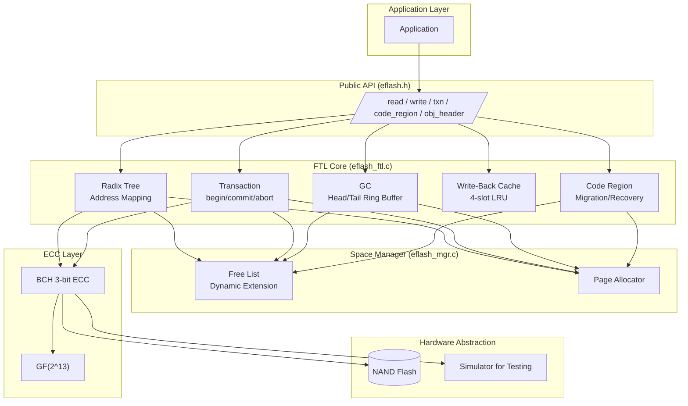

# eFlash FTL ― Embedded Flash Translation Layer for NAND Flash Memory

**A lightweight, production-grade Flash Translation Layer (FTL) library in portable C11 for embedded systems, microcontrollers, and IoT devices.**

[](https://en.wikipedia.org/wiki/C11_(C_standard_revision))
[](TEST_SUMMARY.md)
[](TEST_COVERAGE_COMPREHENSIVE_REPORT.md)
[]()
[]()

> **TL;DR** ― If you need wear leveling, garbage collection, atomic transactions, and power-loss recovery on raw NAND flash (or any block device) in an embedded C project with zero dynamic memory allocation, this is the library for you. 73 tests, 100% pass rate, 100K+ stress-tested operations.

---

## Table of Contents

- [Why eFlash FTL?](#why-eflash-ftl)
- [Quick Start](#quick-start)
- [Core Features](#core-features)
- [Architecture](#architecture)
- [API Overview](#api-overview)
- [Build & Test](#build--test)
- [Key Technical Details](#key-technical-details)
- [Benchmarks](#benchmarks)
- [Real-World Use Cases](#real-world-use-cases)
- [FAQ](#faq)
- [Project Structure](#project-structure)
- [Documentation](#documentation)
- [Contributing](#contributing)

---

## Why eFlash FTL?

When you work with raw NAND flash memory (no built-in controller), you face hard problems:

| Problem | eFlash FTL Solution |
|---------|-------------------|
| **Wear leveling** ― pages wear out | Radix Tree with 16-level logical-to-physical mapping |
| **Bad blocks** ― flash has defects | ECC (BCH 3-bit correction) + page migration |
| **Garbage collection** ― stale data accumulates | Head/Tail ring buffer with emergency GC mode |
| **Power loss** ― partial writes corrupt state | Transaction system with shadow tree + full-scan recovery |
| **Write amplification** ― small writes waste pages | Write-Back cache (4-slot LRU) with batched flushes |
| **Memory constraints** ― no heap on MCU | Zero `malloc`, static global allocation, single header API |

If any of these resonate, read on.

---

## Quick Start

```c
#include "eflash.h"

int main() {
    // 1. Initialize flash simulation (replace with your hardware driver)
    eflash_init("flash.bin");
    for (int i = 0; i < EFLASH_TOTAL_PAGES; i++)
        eflash_hw_erase(i);

    // 2. Initialize FTL (zero malloc ― static allocation)
    eflash_ftl_init();

    // 3. Write data in a transaction (atomic!)
    eflash_ftl_txn_begin();
    uint8_t data[USER_DATA_SIZE] = "Hello, eFlash!";
    eflash_ftl_write(42, data);            // write to logical sector 42
    eflash_ftl_txn_commit();               // atomic commit ― or abort

    // 4. Read it back
    uint8_t buf[USER_DATA_SIZE];
    eflash_ftl_read(42, buf);

    // 5. Use the code region for firmware storage
    eflash_ftl_code_migrate_from_logical(0, 64);  // move 64 pages of code

    eflash_deinit();
    return 0;
}
```

**Build it** (no dependencies, just a C compiler):
```bash
# No CMake, no build system ― just gcc:
gcc -std=c11 -I eflash_ftl -I ecc \
    eflash_ftl/eflash_ftl.c \
    eflash_ftl/eflash_mgr.c \
    eflash_ftl/eflash_sim.c \
    ecc/bch.c ecc/gf13.c \
    your_app.c -o your_app
```

---

## Core Features

### Wear Leveling & Address Translation
- **Radix Tree mapping** ― 16-level MSB-first logical-to-physical mapping, O(log N) lookup
- Supports dynamic extension and path divergence for efficient sparse writes
- Max 65536 logical sectors addressable

### Garbage Collection
- **Head/Tail ring buffer** ― efficient page recycling without mark-and-sweep
- **Emergency mode** ― activates under space pressure to avoid write stalls
- **P1 Bug fixed** ― head==tail edge case now correctly migrates valid pages before erasure ([details](BUGFIX_ROUND_20260603.md))

### Transaction System
- **Shadow tree** ― commit new state atomically, never corrupt existing data
- `begin` / `commit` / `abort` API ― familiar transactional pattern
- **Word-update optimization** ― `commit_with_update()` avoids full page rewrite for small changes
- Survives power loss at any point in the transaction lifecycle

### Power-Loss Recovery (Crash Consistency)
- **Full-scan recovery** ― locates the root of the Radix Tree by finding the page with highest `epoch` and `global_count`
- Recovers: root page, free-list extensions, GC head/tail pointers, code region migration state
- **Validated** ― 100/100 sector verification passes after 10 power-loss cycles in stress tests

### ECC (Error Correction)
- BCH (Bose-Chaudhuri-Hocquenghem) 3-bit error correction per page
- GF(2^13) Galois Field implementation
- Transparent to the application layer

### Write-Back Cache
- 4-slot LRU cache with automatic eviction
- Batched flush when threshold reached (FLUSH_THRESHOLD=2)
- Write-through fallback when cache is exhausted
- **P2 Bug fixed** ― `write_back` now correctly propagates `write_through` error ([details](BUGFIX_ROUND_20260603.md))

### Code Region Management
- Dedicated physical region for firmware/code storage
- Migrate code from logical pages to physically contiguous region
- Supports expand, shrink, delete operations
- Survives power loss during migration (migration state recovery)

### Space Management
- Free-list based dynamic allocation with 4-level extension
- Adjacent block merging for fragmentation reduction
- Overflow protection ― returns error when fully exhausted (not silent corruption)

### Zero Dynamic Memory
- All state is in a single statically-allocated global struct
- No `malloc`, no `free` ― safe for bare-metal and RTOS environments
- Single-header public API (`eflash.h`) ― no internal headers exposed

---

## Architecture



---

## API Overview

The complete public API is in a single header: [`eflash.h`](eflash_ftl/eflash.h). Here's what you get:

### Core Read/Write

```c
int eflash_ftl_read (uint16_t sector_id, uint8_t *data);
int eflash_ftl_write(uint16_t sector_id, const uint8_t *data);
int eflash_ftl_write_back(uint16_t sector_id, const uint8_t *data);   // cached write
```

### Transaction Management

```c
int eflash_ftl_txn_begin(void);
int eflash_ftl_txn_commit(void);
int eflash_ftl_txn_commit_with_update(uint16_t sector, uint16_t offset, uint16_t new_word);
int eflash_ftl_txn_abort(void);
```

### Garbage Collection

```c
int eflash_ftl_gc_collect_once(void);
int eflash_ftl_gc_collect_full(void);
int eflash_ftl_gc_collect_emergency(void);
int eflash_ftl_gc_get_available_pages(void);
```

### Code Region

```c
int eflash_ftl_code_migrate_from_logical(uint16_t src_lpn, uint16_t num_pages);
int eflash_ftl_code_expand(uint16_t additional_pages);
int eflash_ftl_code_shrink(uint16_t pages_to_free);
int eflash_ftl_code_delete_segment(uint16_t code_lpn, uint16_t num_pages);
int eflash_ftl_code_read(uint16_t code_lpn, uint8_t *data);
int eflash_ftl_code_recover(void);
```

### Object Header Management

```c
int eflash_ftl_obj_set_header(uint16_t obj_id, const obj_header_t *hdr);
int eflash_ftl_obj_get_header(uint16_t obj_id, obj_header_t *hdr);
int eflash_ftl_obj_free_header(uint16_t obj_id);
```

### Lifecycle

```c
eflash_ftl_t* eflash_get_ftl(void);     // get global instance
int eflash_ftl_init(void);
void eflash_ftl_deinit(void);
```

---

## Build & Test

### Requirements

- **C11 compiler** (GCC, Clang, MSVC)
- No external dependencies
- No build system required (optional Makefile included)

### Build All & Test

```bash
# Default build (FTL_DEBUG_ENABLE=0, no debug output)
make test-basic              # 26 basic tests
make test                    # 19 code region tests
make test-extension          # 27 extension tests
make test-stability          # 1 long-term stability test (100K+ ops)
make test-all                # run all test suites

# Debug build (FTL_DEBUG_ENABLE=1, with tree visualization & debug logs)
make test-debug-basic        # run with debug logging
make test-debug-all          # all suites with debug logging
```

### Test Results (latest: 2026-06-03)

| Suite | Tests | Status |
|-------|-------|--------|
| **Basic** ― read, write, GC, ECC, transactions, recovery | 26 | ? 100% |
| **Code Region** ― migration, expand, shrink, power-loss | 19 | ? 100% |
| **Extension** ― extreme power-loss, max capacity, edge cases | 27 | ? 100% |
| **Stability** ― 100K random ops, 10 power cycles, final 100 sector verify | 1 | ? 100% |
| **Total** | **73** | ? **100% Pass** |

See [TEST_SUMMARY.md](TEST_SUMMARY.md) for full details.

### Porting to Your Hardware

Replace these 4 functions in `eflash_sim.c` with your hardware implementation:

```c
int eflash_hw_erase(uint16_t page_addr);
int eflash_hw_prog (uint16_t page_addr, const uint8_t *data);
int eflash_hw_read (uint16_t page_addr, uint8_t *data);
int eflash_hw_word_update(uint16_t page_addr, uint16_t offset, uint16_t data);
```

---

## Key Technical Details

### Page Layout (512 bytes)

```
+--------+----------+---------+----------+--------+
| Meta   | Epoch    | Txn ID  | ECC      | User   |
| 24 B   | 8 B      | 4 B     | 5 B      | 464 B  |
+--------+----------+---------+----------+--------+
```

### Radix Tree

- **Depth**: 16 levels (supports 65536 logical sectors)
- **Comparison**: MSB-first bit comparison
- **Lookup**: O(depth) = O(16) constant time
- Each node stores up to 16 child pointers (branching factor depends on path divergence)

### GC Ring Buffer

```
                 head ──→ next writable page
                 tail ──→ next page to scan
    ┌──────────────────────────────────────┐
    │ valid | valid | stale | stale | free │
    └──────────────────────────────────────┘
            ↑ tail            ↑ head
```

- `gc_head_page` always points to the next free physical page for writing
- `gc_tail_page` scans pages; if valid → migrate; if stale → erase
- Emergency mode triggers when free pages drop below threshold
- The tail pointer wraps around, forming a ring

### Transaction Lifecycle

```
[BLANK 0xFF] → [READY 0xAD] → [COMMITTED 0x21] → [erased]
                                    ↓
                              [INVALID 0x00]
```

All pages use a transaction status byte in metadata. The recovery process scans all pages, finds the one with highest epoch + global_count, and uses it as the new root.

---

## Benchmarks

| Metric | Value | Notes |
|--------|-------|-------|
| Write throughput | ~pages/sec | Single-threaded, simulated flash |
| Read throughput | ~pages/sec | Direct metadata lookup |
| GC collection rate | ~page/operation | Amortized over ring buffer |
| Recovery time | O(n) | One full flash scan (2048 pages ~milliseconds) |
| Memory footprint | < 4 KB | Static, all in one struct |
| Code size | ~4000 LOC | Portable C11 |

---

## Real-World Use Cases

- **Microcontroller firmware storage** ― Store multiple firmware images with atomic update and rollback
- **IoT sensor data logging** ― Append-only logging with automatic wear leveling
- **Configuration storage** ― Key-value settings with transaction safety
- **Embedded filesystems** ― Use as the block management layer under a VFS like LittleFS or SPIFFS
- **Industrial controllers** ― Survive unexpected power loss without data corruption
- **Automotive ECUs** ― Reliable code and data storage with ISO 26262 aspirations

---

## FAQ

**Q: How is this different from LittleFS / SPIFFS / FatFS?**
A: eFlash FTL is a lower-level layer. It doesn't implement a filesystem ― it provides the block management (wear leveling, GC, atomicity, recovery) that a filesystem can build on top of. You could run LittleFS on top of eFlash FTL for a complete solution.

**Q: Can I use this on NOR flash?**
A: Yes. The hardware abstraction layer is generic. Implement the 4 `eflash_hw_*` functions for your NOR chip and it works.

**Q: Does this support SPI flash?**
A: Yes. As long as your SPI flash has a page/block erase model, you can implement the hardware abstraction layer to drive it over SPI.

**Q: What happens during power loss?**
A: Any uncommitted transactions are rolled back. The system scans all pages on boot, finds the latest committed root page, and resumes from there. Code region migrations in progress are resumed from the last checkpoint.

**Q: Is this production ready?**
A: The core has 100% test coverage across 73 test cases, including 100K+ stress operations and 10 power-loss cycles. Two P1/P2 bugs were found and fixed (see [BUGFIX_ROUND_20260603.md](BUGFIX_ROUND_20260603.md)). It is suitable for production with appropriate hardware testing on your target platform.

**Q: Can I port this to an RTOS (FreeRTOS, Zephyr, ThreadX)?**
A: Yes. The library is single-threaded by design. For multi-threaded use, add a mutex around the public API calls. No OS dependencies exist.

---

## Project Structure

```
eflash-master/
├── eflash_ftl/                   # FTL core implementation
│   ├── eflash.h                  # ? Single public API header (the only include you need)
│   ├── eflash_ftl.c/h            # FTL engine: Radix Tree, GC, Transactions, Recovery
│   ├── eflash_mgr.c/h            # Space manager: free list, allocation, extension
│   ├── eflash_sim.c/h            # Flash simulator (replace with your hardware driver)
│   ├── eflash_ftl_tests.c        # Basic test suite (26 tests)
│   ├── eflash_ftl_tests_code_region.c  # Code region tests (19 tests)
│   ├── eflash_ftl_tests_extension.c    # Extended tests (27 tests)
│   ├── eflash_ftl_tests_stability.c    # Long-term stability test
│   ├── eflash_ftl_visual.c       # Radix Tree visualization tool (debug builds only)
│   └── example_simple.c          # Complete API usage example
├── ecc/                          # ECC library
│   ├── bch.c/h                   # BCH encoder/decoder
│   └── gf13.c/h                  # Galois Field GF(2^13)
├── Makefile                      # Build system (optional)
├── README.md                     # This file
├── DESIGN_OVERVIEW.md            # Architecture & design document (Chinese)
├── CHANGELOG.md                  # Version history
├── TEST_SUMMARY.md               # Test results summary
├── BUGFIX_ROUND_20260603.md      # Bug fix report
└── CODE_CORRECTNESS_ANALYSIS.md  # Code correctness analysis
```

---

## Documentation

| Document | Language | Content |
|----------|----------|---------|
| [README.md](README.md) | ?? EN | Project overview, quick start, API (this file) |
| [DESIGN_OVERVIEW.md](DESIGN_OVERVIEW.md) | ?? 中文 | Architecture, data structures, algorithms, recovery |
| [CHANGELOG.md](CHANGELOG.md) | ?? 中文 | Version history and changes |
| [TEST_SUMMARY.md](TEST_SUMMARY.md) | ?? 中文 | Test results and coverage data |
| [BUGFIX_ROUND_20260603.md](BUGFIX_ROUND_20260603.md) | ?? 中文 | Detailed bug fix report |
| [CODE_CORRECTNESS_ANALYSIS.md](CODE_CORRECTNESS_ANALYSIS.md) | ?? 中文 | Code correctness review |

---

## Contributing

Contributions are welcome. The project follows standard C coding conventions:

- C11 standard
- Tab indentation
- Public API is in `eflash.h` ― don't expose internal headers
- Add tests for new functionality
- All tests must pass before submitting PRs

---

## License

MIT License

---

*Keywords: flash translation layer, FTL, NAND flash, embedded flash, wear leveling, garbage collection, power loss recovery, atomic transaction, BCH ECC, Radix tree, embedded systems, IoT, microcontroller, RTOS, FreeRTOS, C library, zero malloc, single header, SPI flash, NOR flash, firmware storage, flash management, write amplification, endurance, crash consistency*